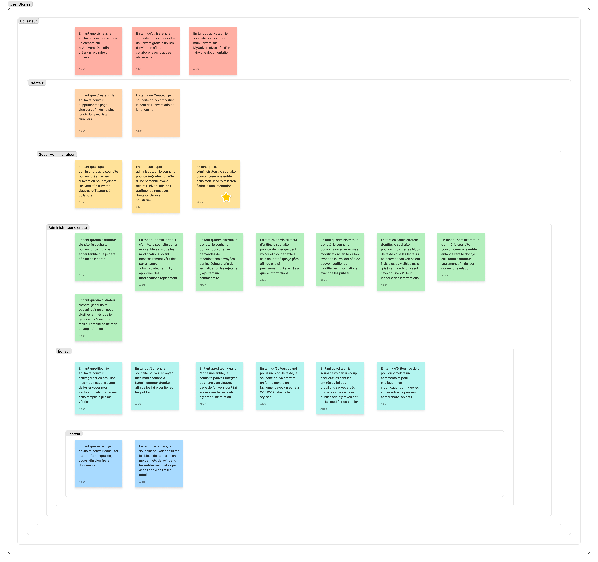
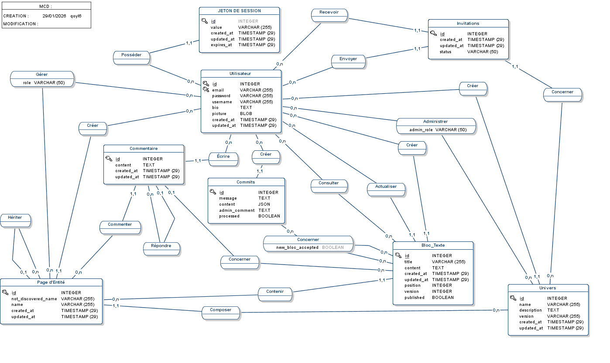
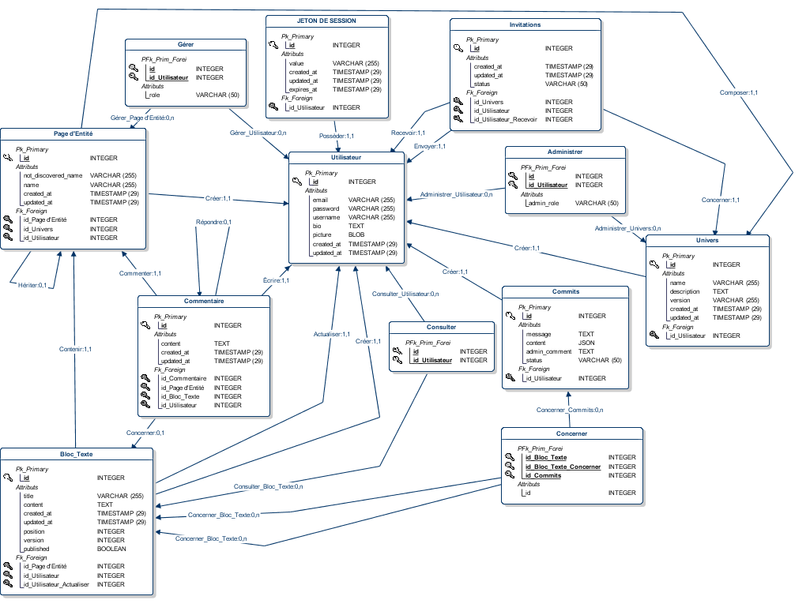
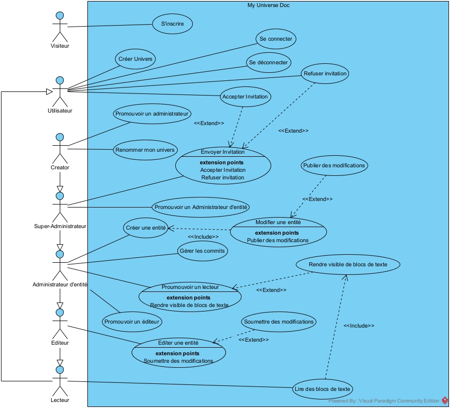
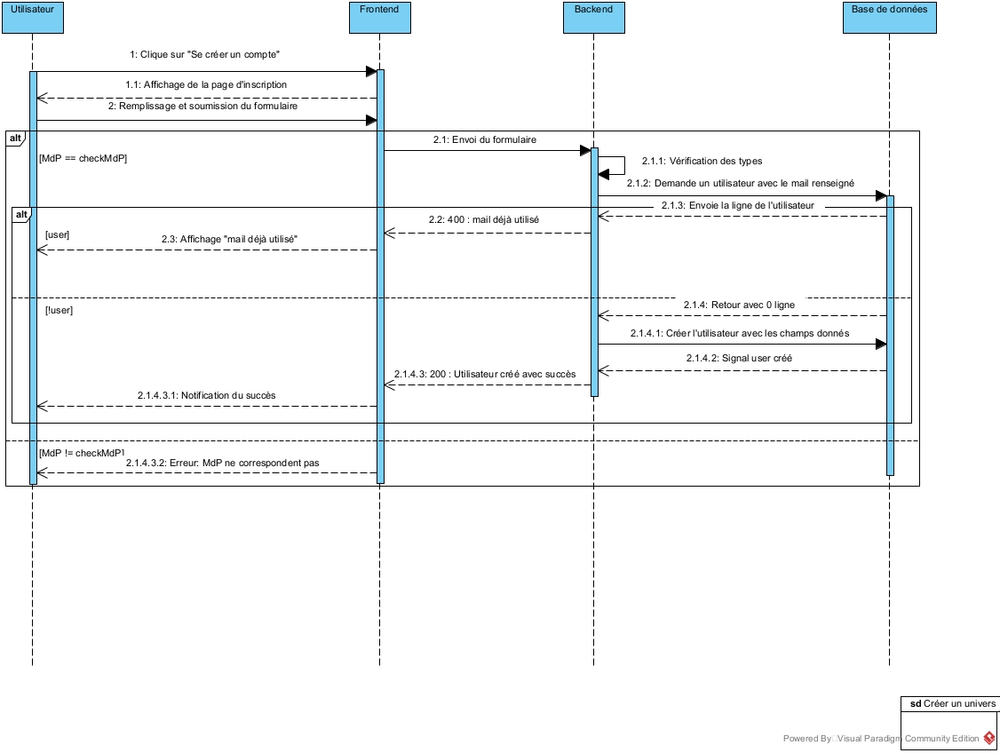
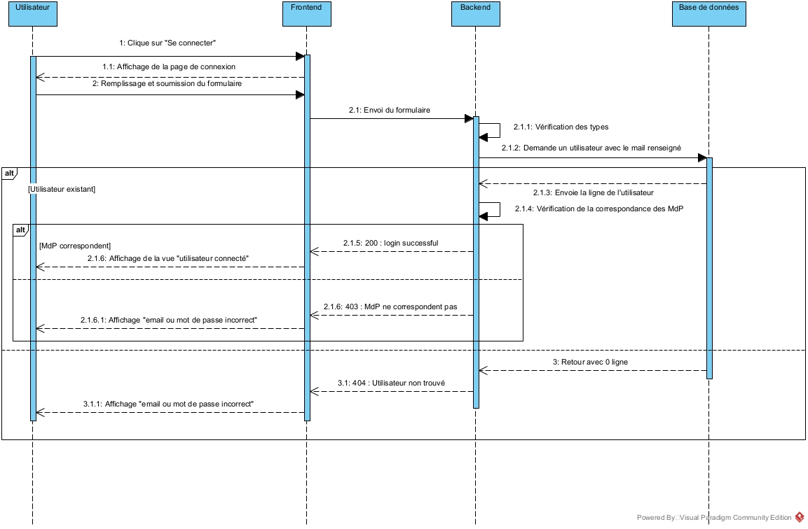
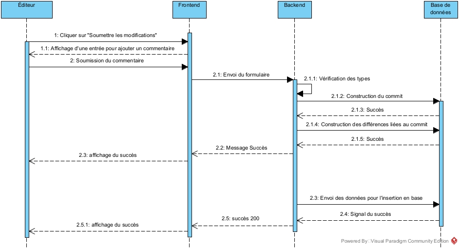
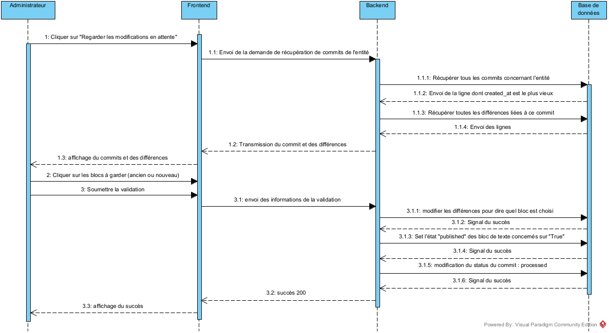

# Rendu UML pour le 01/02/2026

## A propos

J'accorde beaucoup d'importance à la conception dans mon projet et à la confection de schéma UML correct. Il est compliqué de comprendre ce qu'il est bon de faire ou pas avec les ressources sur internet. Je me suis donc permis de rajouter quelque commentaires pour expliquer mes choix. J'espère que vous prendrez le temps de les lire.

S'il y a des erreurs que vous constatez, pouvez-vous m'en faire un rapport sur teams ? Ou bien par [mail : albangenta.pro27@gmail.com](mailto:albangenta.pro27@gmail.com).

Je vous remercie.

Alban GENTA.

## User Stories

Commentaire :
Un tableau avec les différentes User Stories en fonction de leur rôle. Toutes ne sont pas dans le MVP.
Aussi, dans la section "utilisateur", il y a une US pour les visiteur par rapport à la création de compte. C'est bien un rôle différent mais je l'ai laissé dans cette section afin de pas rendre trop compliqué la lisibilité du tableau.

NB : La petite étoile est un reliquat, elle n'est pas sensée être sur l'image : ne pas en prendre compte.

## Merise

### MCD

### MLD

## Use Cases

Commentaire :
J'ai utilisé la "Généralisation" (flèche triangulaire creuse) pour symboliser l'héritage des droits.
Un lecteur a les droits d'un utilisateur.
Un éditeur a les droits d'un lecteur.
Un administrateur d'entité a les droits d'un éditeur.
Un super administrateur a les droits d'un administrateur d'entité.
Le créateur de l'univers a les droits d'un super administrateur.
Je ne savais pas trop comment faire autrement pour éviter qu'il y ait des flèches pour chaque rôles qui avait le droit de faire chaque use cases. Cela m'aurait semblé trop brouillon.

## Diagrammes de Séquence

### Se créer un compte

### Connexion

### Créer un univers

Commentaire :
Ce diagramme fonctionne dans un contexte où il n'y a pas d'erreur : d'où l'absence de frame "alt". Il me semble qu'il existe une frame pour ce genre de chose mais je ne l'ai pas trouvé. IL en va de même pour les deux diagrammes suivants.

### Soumettre des modifications

### Validation des modifications

Commentaire :
Durant l'étape où l'administrateur doit valider les différence ou non, il y a une boucle où l'utilisateur, pour chaque boucle, clique sur "valider" ou "pas valider". Je ne savais pas trop s'il fallait l'expliciter ou non donc je l'ai laissé comme ça.
